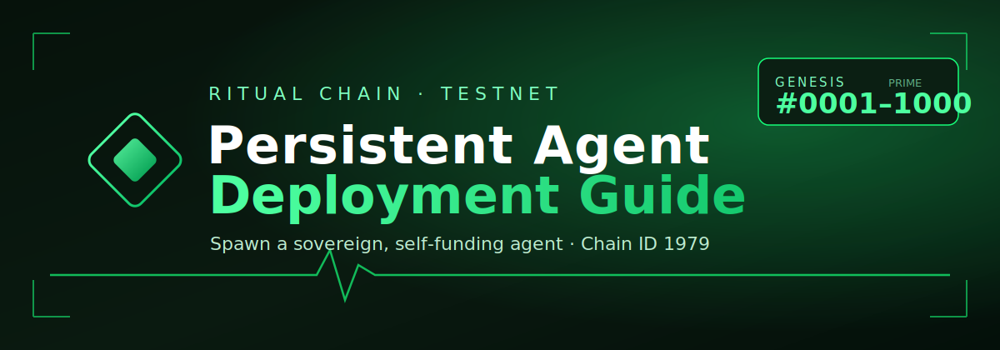
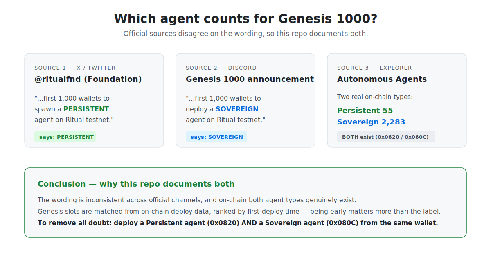

<p align="center">
  
</p>

<h1 align="center">Ritual Agent Deployment</h1>

<p align="center">
  A practical, tested guide to deploying autonomous agents on the Ritual Chain testnet
  and registering for Genesis 1000. Covers both agent types.
</p>

<p align="center"><i>Made by Sanujit</i></p>

<p align="center">
  <a href="https://docs.ritualfoundation.org">Docs</a> ·
  <a href="https://faucet.ritualfoundation.org">Faucet</a> ·
  <a href="https://explorer.ritualfoundation.org">Explorer</a> ·
  <a href="https://skills.ritualfoundation.org">Skills</a>
</p>

---

## Contents

- [Persistent vs. Sovereign](#persistent-vs-sovereign)
- [Official endpoints](#official-endpoints)
- [Build it with Claude or any coding agent](#build-it-with-claude-or-any-coding-agent)
- [Overview](#overview)
- [Faucet walkthrough](#faucet-walkthrough)
- [The guides](#the-guides)
- [Claim Genesis 1000](#claim-genesis-1000)
- [Repository layout](#repository-layout)
- [Reference](#reference-addresses--constants)

---

## Persistent vs. Sovereign

The official sources use different words for what earns a Genesis 1000 slot.

<p align="center">
  
</p>

| Source | Wording |
|--------|---------|
| Foundation tweet ([@ritualfnd](https://x.com/ritualfnd)) | "first 1,000 wallets to spawn a **persistent** agent" |
| Discord Genesis 1000 announcement | "first 1,000 wallets to deploy a **sovereign** agent" |
| Explorer → Agents | Two on-chain types exist: **Persistent** (`0x0820`) and **Sovereign** (`0x080C`) |

Genesis slots are matched from on-chain deploy data, ranked by first-deploy time, so deploying
early matters more than the label. Because the wording is inconsistent and both types genuinely
exist on-chain, this repository documents both. To remove any doubt, deploy a
[persistent](docs/PERSISTENT_AGENT.md) and a [sovereign](docs/SOVEREIGN_AGENT.md) agent from the
same wallet, then link that wallet in Discord and run `/genesis_claim`.

| | Persistent (`0x0820`) | Sovereign (`0x080C`) |
|--|------------------------|----------------------|
| Runs as | Long-lived container in a TEE | Contract that self-schedules via the Scheduler |
| Needs a DA store (HuggingFace/Pinata/GCS) | Yes | Optional |
| Needs a funded heartbeat wallet | Yes (~0.1 RIT) | No |
| Common failure | `maximum instance count reached` | Rare |
| Guide | [docs/PERSISTENT_AGENT.md](docs/PERSISTENT_AGENT.md) | [docs/SOVEREIGN_AGENT.md](docs/SOVEREIGN_AGENT.md) |

---

## Official endpoints

| Resource | URL |
|----------|-----|
| Docs | https://docs.ritualfoundation.org |
| Faucet | https://faucet.ritualfoundation.org |
| Explorer | https://explorer.ritualfoundation.org |
| RPC | https://rpc.ritualfoundation.org |
| Agent Skills | https://skills.ritualfoundation.org |

Chain ID: `1979`

---

## Build it with Claude or any coding agent

You can have an AI coding agent (Claude Code, Cursor, etc.) do the whole deployment. Give it the
endpoints above and the skills repo, then ask it to follow this guide.

1. Install the Ritual skills so the agent has the precompile patterns and deploy workflow:

   ```bash
   git clone https://github.com/ritual-foundation/ritual-dapp-skills.git .claude/skills/ritual-dapp-skills
   ```

2. Paste a prompt like this to your agent:

   > Read https://skills.ritualfoundation.org and the cloned `ritual-dapp-skills` repo.
   > Deploy a persistent agent (precompile `0x0820`) on Ritual testnet (Chain ID `1979`,
   > RPC `https://rpc.ritualfoundation.org`). I will provide a throwaway `PRIVATE_KEY`, an
   > `ANTHROPIC_API_KEY`, and HuggingFace `HF_TOKEN` + `HF_REPO_ID`. Fund from
   > https://faucet.ritualfoundation.org, pick an executor with free capacity, run the spawn,
   > then verify the agent on https://explorer.ritualfoundation.org.

3. Provide only throwaway/testnet credentials. The agent should never commit your `.env`.

This repository is the reference the agent (or you) follows for each step.

---

## Overview

1. Install Foundry and uv (Linux/WSL).
2. Clone `ritual-dapp-skills`.
3. Get a throwaway key, an LLM API key, and (for persistent) a HuggingFace store.
4. Claim test-RITUAL from the faucet — see the [walkthrough](#faucet-walkthrough).
5. Configure `.env`, run `bash run.sh`, and verify on the Explorer.
6. Link your wallet in Discord and run `/genesis_claim`.

See [docs/ENV_SETUP.md](docs/ENV_SETUP.md) for how to obtain every `.env` value.

---

## Faucet walkthrough

Testnet RITUAL is free and pays for gas and agent funding.

**1. Find your wallet address.**
```bash
cast wallet new                                    # generates a fresh key + address
# or, if PRIVATE_KEY is already set:
cast wallet address --private-key "$PRIVATE_KEY"
```
Copy the `0x…` address (not the private key).

**2. Open the faucet:** https://faucet.ritualfoundation.org

**3. Claim.** Paste your address (or connect a wallet). If prompted for an access code or a
Discord/social link, use your own — this also helps Genesis attribute the deploy to you.

**4. Confirm it arrived.**
```bash
cast balance 0xYOUR_ADDRESS --rpc-url https://rpc.ritualfoundation.org
```
Balance prints in wei; divide by 1e18 for RITUAL. Aim for at least ~3 RIT for a persistent deploy
with the small-amount config in the guide.

**5. If the drip is small,** lower the spend in `.env`:
```bash
DEPOSIT_WEI=1000000000000000000          # 1 RIT
CHILD_FUND_WEI=1000000000000000000       # 1 RIT (persistent only)
CHILD_MIN_NATIVE_WEI=100000000000000000  # 0.1 RIT floor
```

**6. Top up the heartbeat wallet later (persistent only).** The agent's child wallet pays for
heartbeats. Paste the child address into the faucet, or send from your sender:
```bash
cast send 0xCHILD_ADDRESS --value 0.5ether \
  --private-key "$PRIVATE_KEY" --rpc-url https://rpc.ritualfoundation.org
```

> Testnet only. Use a brand-new throwaway key. Never put a key holding real funds — or any faucet
> or LLM secret — into a `.env`, a terminal, a screenshot, or a chat.

---

## The guides

- [Persistent Agent guide](docs/PERSISTENT_AGENT.md) — container-in-TEE agent, DA store,
  heartbeats, executor selection, troubleshooting.
- [Sovereign Agent guide](docs/SOVEREIGN_AGENT.md) — contract-driven self-scheduling agent,
  ECIES-encrypted secrets, lighter setup.
- [How to get every `.env` value](docs/ENV_SETUP.md) — each credential, step by step.

---

## Claim Genesis 1000

After deploying either or both types:

1. In the Ritual Discord, complete the bot's "Link your Genesis 1000 wallet" flow using
   Self-Transaction — send the exact amount it asks from your wallet to itself:
   ```bash
   cast send 0xYOUR_SENDER_ADDRESS --value <EXACT_WEI> \
     --private-key "$PRIVATE_KEY" --rpc-url https://rpc.ritualfoundation.org
   ```
   Paste the transaction hash back to the bot.
2. Run `/genesis_claim`. If matched, you describe your agent in one line and receive a numbered
   card plus the Genesis 1000 role.

Slots sync from on-chain data weekly, so a new deploy may show "not in Genesis yet" until the next
sync. Open a Discord ticket if you used a gifted or extra access code.

---

## Repository layout

```
.
├── README.md                  hub: persistent vs sovereign, faucet, links
├── assets/
│   ├── banner.svg
│   ├── sources-comparison.svg why both guides exist
│   └── img/                   add your own screenshots (see img/README.md)
└── docs/
    ├── PERSISTENT_AGENT.md
    ├── SOVEREIGN_AGENT.md
    └── ENV_SETUP.md           how to get every .env value
```

---

## Reference: addresses & constants

| Name | Value |
|------|-------|
| Chain ID | `1979` |
| RPC | `https://rpc.ritualfoundation.org` |
| Persistent Agent precompile | `0x0820` |
| Sovereign Agent precompile | `0x080C` |
| DKMS key precompile | `0x081B` |
| RitualWallet | `0x532F0dF0896F353d8C3DD8cc134e8129DA2a3948` |
| AsyncJobTracker | `0xC069FFCa0389f44eCA2C626e55491b0ab045AEF5` |
| TEEServiceRegistry | `0x9644e8562cE0Fe12b4deeC4163c064A8862Bf47F` |
| AgentHeartbeat | `0xEF505E801f1Db392B5289690E2ffc20e840A3aCa` |
| SovereignAgentFactory | `0x9dC4C054e53bCc4Ce0A0Ff09E890A7a8e817f304` |
| Async delivery (callback sender) | `0x5A16214fF555848411544b005f7Ac063742f39F6` |
| Heartbeat interval / timeout | `100` / `200` blocks |

---

<p align="center"><sub>Made by Sanujit · Built from a real end-to-end deploy on Ritual testnet. Testnet only — never use a key that holds real funds.</sub></p>
