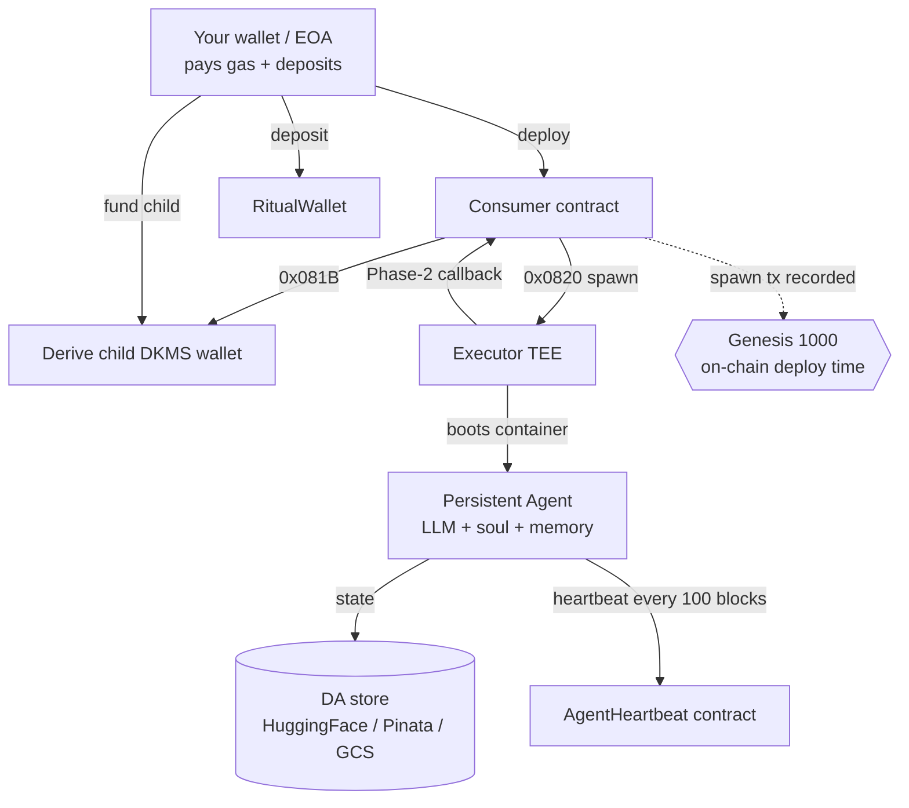

<p align="center">
  
</p>

<h1 align="center">Persistent Agent — Deployment Guide</h1>

<p align="center">
  Spawn a long-running <b>persistent agent</b> (precompile <code>0x0820</code>) that lives in a
  TEE container, derives its own wallet, posts on-chain heartbeats, and persists state off-chain.
</p>

<p align="center"><a href="../README.md">← back to hub</a> · <a href="SOVEREIGN_AGENT.md">Sovereign guide →</a></p>

---

> The on-chain spawn transaction is what counts toward **Genesis 1000** — the registry of the
> first 1,000 wallets to deploy an agent, ranked by on-chain deploy time.

> [!WARNING]
> **Testnet only.** Use a brand-new throwaway private key. **Never** put a key that holds real
> funds in a `.env`, a terminal, or a chat. Your LLM API key is a **real, billable** credential.

---

## Table of Contents

1. [How it works](#1-how-it-works)
2. [Prerequisites](#2-prerequisites)
3. [Accounts & credentials](#3-accounts--credentials)
4. [Clone the skills repo](#4-clone-the-skills-repo)
5. [Configure your `.env`](#5-configure-your-env)
6. [Fund your wallet (faucet)](#6-fund-your-wallet-faucet)
7. [Pick an executor with free capacity](#7-pick-an-executor-with-free-capacity)
8. [Run the deployment](#8-run-the-deployment)
9. [Verify your agent on-chain](#9-verify-your-agent-on-chain)
10. [Keep your agent alive](#10-keep-your-agent-alive)
11. [Troubleshooting](#11-troubleshooting-every-error-we-hit)
12. [FAQ](#12-faq)

---

## 1. How it works

A tiny **consumer contract** calls the **persistent-agent precompile `0x0820`**. The chain
launches your agent as a **Docker container inside a TEE** on an **executor** node. The agent gets
a **DKMS-derived child wallet** (key never leaves the enclave) that pays for **heartbeats** —
small on-chain pings proving it's alive. State lives off-chain on a **Data Availability (DA)**
provider (HuggingFace / GCS / Pinata).



**Two meanings of "alive":**
- **Deployed** = your `0x0820` spawn tx landed on-chain. *This is what Genesis counts.*
- **Running** = container booted **and** posting heartbeats. Needs a free executor + reachable RPC.

---

## 2. Prerequisites

| Tool | Why | Install |
|------|-----|---------|
| **Linux / WSL** | `run.sh` is bash | `wsl --install` |
| **Foundry** (`forge`,`cast`) | deploy + chain calls | `curl -L https://foundry.paradigm.xyz \| bash && foundryup` |
| **uv** | runs the Python helper | `curl -LsSf https://astral.sh/uv/install.sh \| sh` |
| **git** | clone skills repo | preinstalled |

```bash
cast --version && forge --version && uv --version
```

---

## 3. Accounts & credentials

1. **Throwaway EVM key:** `cast wallet new`
2. **One LLM key:** `ANTHROPIC_API_KEY` (recommended) / `OPENAI_API_KEY` / `GEMINI_API_KEY` / `OPENROUTER_API_KEY`
3. **A DA provider** (pick one):

   <details><summary><b>HuggingFace (easiest)</b></summary>

   - Account at huggingface.co → create a **dataset** repo (huggingface.co/new-dataset), e.g. `my-agent-store`
   - Create a **Write** token: huggingface.co/settings/tokens
   - You need: `HF_TOKEN=hf_...`, `HF_REPO_ID=your-username/my-agent-store` (`user/repo`, not a URL)
   </details>

   <details><summary><b>Pinata (single credential)</b></summary>

   - pinata.cloud → **API Keys → New Key** (Pinning scopes) → copy the **JWT** (`eyJ...`)
   - You need: `DA_PINATA_JWT=eyJ...` (optional `DA_PINATA_GATEWAY=https://...mypinata.cloud`)
   </details>

   <details><summary><b>GCS</b></summary>

   - You need: `GCS_DA_SERVICE_ACCOUNT_JSON='{...}'`, `GCS_DA_BUCKET=my-bucket`, optional `GCS_DA_PREFIX=agents/demo`
   </details>

> [!IMPORTANT]
> The DA store is the agent's **persistent memory** — don't delete it or revoke the token after
> deploying, or the agent can't restore from checkpoint.

---

## 4. Clone the skills repo

```bash
git clone https://github.com/ritual-foundation/ritual-dapp-skills.git
cd ritual-dapp-skills/examples/persistent-agent
```

| File | Purpose |
|------|---------|
| `PersistentAgentConsumer.sol` | Calls `0x0820` + `0x081B`, receives Phase-2 callback |
| `run.sh` | Orchestrator: deploy → preflight → derive child → fund → spawn → wait |
| `helpers.py` | Builds request payloads, polls results |
| `list_executors.py` | *(from this guide)* lists executors to avoid a full one |

---

## 5. Configure your `.env`

Create `.env` in `examples/persistent-agent/`. **Tune amounts to your faucet balance.**

```bash
# ── required ───────────────────────────────────────────────
RPC_URL="https://rpc.ritualfoundation.org"
PRIVATE_KEY="0xYOUR_FRESH_THROWAWAY_KEY"
ANTHROPIC_API_KEY="sk-ant-..."           # exactly one LLM key

# ── data availability (HuggingFace example) ────────────────
DA_PROVIDER="hf"
HF_TOKEN="hf_..."
HF_REPO_ID="your-username/my-agent-store"

# ── CRITICAL: agent container's RPC (NOT the docker default) ──
AGENT_RPC_URL="https://rpc.ritualfoundation.org"

# ── amounts sized for a small (~5 RIT) faucet drip ─────────
DEPOSIT_WEI=1000000000000000000            # 1 RIT into RitualWallet
MIN_RITUAL_WALLET_WEI=1000000000000000000  # require only 1 RIT
CHILD_FUND_WEI=1000000000000000000         # fund agent child with 1 RIT
CHILD_MIN_NATIVE_WEI=100000000000000000    # child heartbeat floor: 0.1 RIT

# ── optional: pin a specific executor (see step 7) ─────────
# EXECUTOR_TEE_ADDRESS=0x...
```

> [!CAUTION]
> **`AGENT_RPC_URL` matters.** The script default is `http://172.17.0.1:8545` (a Docker-bridge
> address). Your agent runs on a **remote** executor, so that's unreachable from its container —
> it could never heartbeat and would be marked dead. Always set the **public RPC**.

> [!NOTE]
> **Smaller amounts:** `run.sh` defaults to depositing **5 RIT** and funding the child with
> **100,000 RIT** — impossible on a small drip. The heartbeat floor is only ~0.1 RIT.

### Loading `.env` correctly (common pitfall)

`run.sh` runs as a **child process**, so plain `source .env` (no `export`) isn't inherited:

```bash
set -a          # export everything until 'set +a'
source .env
set +a
echo "$RPC_URL"            # -> https://rpc.ritualfoundation.org
echo "${PRIVATE_KEY:0:6}"  # -> 0x....
```

---

## 6. Fund your wallet (faucet)

```bash
cast wallet address --private-key "$PRIVATE_KEY"     # your sender address
```
Take that `0x…` to **https://faucet.ritualfoundation.org** and claim. You need ~**3 RIT** with the
config above. Confirm:
```bash
cast balance "$(cast wallet address --private-key "$PRIVATE_KEY")" --rpc-url "$RPC_URL"
```
(See the [full faucet walkthrough in the hub README](../README.md#-faucet-step-by-step).)

---

## 7. Pick an executor with free capacity

The default flow picks executor **index 0**, which fills first and returns
`maximum instance count reached`. List all executors and pin a different one.

Save `list_executors.py` in `examples/persistent-agent/`:

```python
#!/usr/bin/env python3
# Run:  uv run --with web3 python3 list_executors.py
import os
from web3 import Web3
RPC = os.getenv("RPC_URL", "https://rpc.ritualfoundation.org")
REGISTRY = "0x9644e8562cE0Fe12b4deeC4163c064A8862Bf47F"
ABI = [{"name":"getServicesByCapability","type":"function","stateMutability":"view",
  "inputs":[{"name":"capability","type":"uint8"},{"name":"checkValidity","type":"bool"}],
  "outputs":[{"name":"","type":"tuple[]","components":[
    {"name":"node","type":"tuple","components":[
      {"name":"paymentAddress","type":"address"},{"name":"teeAddress","type":"address"},
      {"name":"teeType","type":"uint8"},{"name":"publicKey","type":"bytes"},
      {"name":"endpoint","type":"string"},{"name":"certPubKeyHash","type":"bytes32"},
      {"name":"capability","type":"uint8"}]},
    {"name":"isValid","type":"bool"},{"name":"workloadId","type":"bytes32"}]}]}]
w3 = Web3(Web3.HTTPProvider(RPC))
c = w3.eth.contract(address=Web3.to_checksum_address(REGISTRY), abi=ABI)
for i, s in enumerate(c.functions.getServicesByCapability(0, True).call()):
    n = s[0]
    print(f"[{i}] tee={Web3.to_checksum_address(n[1])}  valid={s[1]}  endpoint={n[4]}")
```

```bash
uv run --with web3 python3 list_executors.py
```

Pick any entry **not index 0**, set it in `.env`:
```bash
EXECUTOR_TEE_ADDRESS=0x79ED9c8D5A3b3a11B9f82DB6eeAC3313f86B843F   # example — pick your own
```

> [!TIP]
> Capacity isn't readable in advance — it's try-and-see. Each attempt costs only gas (~0.3 RIT)
> and reuses your deposit, so just try another index if one is full.

---

## 8. Run the deployment

```bash
set -a; source .env; set +a
bash run.sh
```

Stages: **preflight → fund RitualWallet → deploy consumer → select executor → derive child
(`0x081B`) → fund child → build request → spawn (`0x0820`) → wait Phase-2 callback.**

### Success looks like
```
Phase 1 tx: 0xc1e3...c467
INSTANCE_ID=0x7c25...912a
CONTAINER_ID=57d338bb...d548d      <-- a real container booted
ERROR_MESSAGE=                      <-- EMPTY = no error 🎉
```
Empty `ERROR_MESSAGE` + a real `CONTAINER_ID` = launched. If it says
`maximum instance count reached`, your executor was full → step 7, pick another.

---

## 9. Verify your agent on-chain

```bash
cast receipt 0xYOUR_SPAWN_TX --rpc-url "$RPC_URL" | grep -E 'status|blockNumber'  # status 0x1
CHILD=0xYOUR_CHILD_ADDRESS
cast nonce   "$CHILD" --rpc-url "$RPC_URL"   # > 0 once heartbeating
cast balance "$CHILD" --rpc-url "$RPC_URL"
```
Then open **[Explorer → Agents](https://explorer.ritualfoundation.org)** and search your child/
consumer address. A healthy agent shows **Persistent · Active/Monitored** after its first
heartbeat (can lag boot by a few minutes while it writes the first checkpoint).

---

## 10. Keep your agent alive

Heartbeats are paid by the **child wallet**, not your main wallet. Top it up from the faucet
(paste the child address) or:
```bash
cast send 0xYOUR_CHILD_ADDRESS --value 0.5ether \
  --private-key "$PRIVATE_KEY" --rpc-url "$RPC_URL"
```
Refund if it drops below ~0.1 RIT.

---

## 11. Troubleshooting (every error we hit)

| Symptom | Cause | Fix |
|--------|-------|-----|
| `ERROR: RPC_URL is required …` | `.env` sourced without export | `set -a; source .env; set +a` |
| `gas required exceeds allowance (0)` | Sender has 0/too little RITUAL for gas | Faucet sender; lower `DEPOSIT_WEI` |
| Deposit ≈ whole balance | `DEPOSIT_WEI` ≥ balance | Lower `DEPOSIT_WEI` (e.g. 1 RIT) |
| Phase-2 `maximum instance count reached` | Executor full (usually index 0) | List executors, set `EXECUTOR_TEE_ADDRESS` |
| Spawn ok but **0 heartbeats** | Agent RPC unreachable (docker default) | Set `AGENT_RPC_URL` to public RPC, re-run |
| `Sender has a pending async job` | Prior async job unresolved | Wait, or use a fresh key |
| `DA_PROVIDER=hf requires HF_TOKEN and HF_REPO_ID` | Missing/placeholder creds | Fill real values; `HF_REPO_ID` = `user/repo` |

---

## 12. FAQ

**Persistent or sovereign?** You deployed via the **persistent** precompile `0x0820`. See the
[hub README](../README.md#️-read-this-first-persistent-vs-sovereign) for why both terms appear and
why we ship both guides.

**Deploy or live agent for Genesis?** The tweet says *"ranked by on-chain first-deploy time"* —
your spawn tx. Getting it running is still worth it and removes ambiguity.

**Cost?** On-chain: free testnet RITUAL. Off-chain: your LLM key bills real money; DA uses your account.

**Re-run safely?** Yes — the child wallet is deterministic and the deposit is reused.
