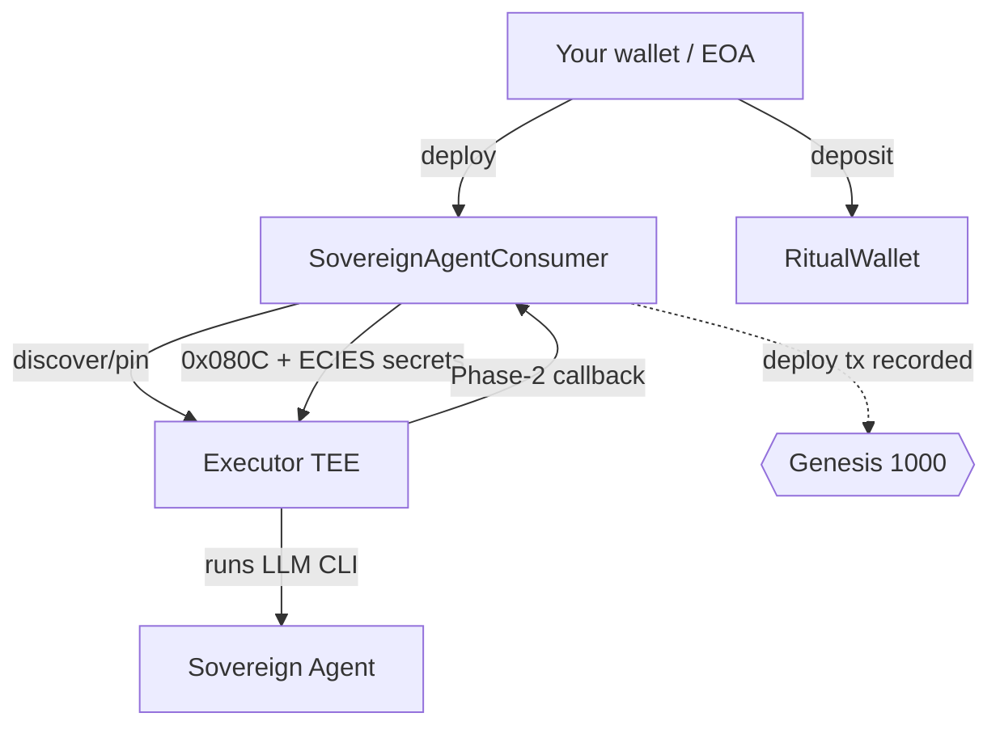

<p align="center">
  
</p>

<h1 align="center">Sovereign Agent — Deployment Guide</h1>

<p align="center">
  Deploy a <b>sovereign agent</b> (precompile <code>0x080C</code>) — a contract-driven agent that
  schedules itself, runs an LLM CLI in a TEE, and is lighter to operate than a persistent agent.
</p>

<p align="center"><a href="../README.md">← back to hub</a> · <a href="PERSISTENT_AGENT.md">Persistent guide →</a></p>

---

> Like the persistent path, the on-chain deploy is what counts toward **Genesis 1000**. The
> Explorer shows far more sovereign agents than persistent ones, so executor capacity is rarely a
> problem here.

> [!WARNING]
> **Testnet only.** Use a brand-new throwaway key. Your LLM API key is a **real, billable**
> secret — never commit it or paste it anywhere.

---

## 1. How it differs from a Persistent agent

| | **Sovereign** (`0x080C`) | **Persistent** (`0x0820`) |
|--|--------------------------|---------------------------|
| Model | Contract self-schedules via the **Scheduler** | Long-lived container with **heartbeats** |
| DA store required | **No** (can run with empty DA refs) | **Yes** |
| Child heartbeat wallet | **Not needed** | Needed (~0.1 RIT) |
| Secrets | **ECIES-encrypted** before submit | Encrypted secrets in the request |
| Typical failure | Rare (lightweight) | `maximum instance count reached` |

There are two deployment modes:
1. **Direct precompile caller mode** (this example) — a consumer contract calls `0x080C` directly.
2. **Factory-backed harness mode** (production) — deploy `SovereignAgentHarness` via
   `SovereignAgentFactory` (`0x9dC4C054e53bCc4Ce0A0Ff09E890A7a8e817f304`), then configure/fund/start.
   See `skills/ritual-dapp-agents/SKILL.md`.



---

## 2. Prerequisites

Same as the persistent guide:

```bash
curl -L https://foundry.paradigm.xyz | bash && foundryup      # forge + cast
curl -LsSf https://astral.sh/uv/install.sh | sh               # uv
cast --version && forge --version && uv --version
```
Use **Linux/WSL** (the script is bash).

---

## 3. Get your credentials

See **[ENV_SETUP.md](ENV_SETUP.md)** for exactly how to obtain each value. In short:

1. **Throwaway key:** `cast wallet new`
2. **One LLM key** + the exact **`MODEL`** id (sovereign requires `MODEL`)
3. **HuggingFace** token + dataset repo (stores conversation history / system prompt)

---

## 4. Clone & enter the example

```bash
git clone https://github.com/ritual-foundation/ritual-dapp-skills.git
cd ritual-dapp-skills/examples/sovereign-agent
```

| File | Purpose |
|------|---------|
| `SovereignAgentConsumer.sol` | Minimal consumer with the `0x080C` callback |
| `run.sh` | Orchestrator: deploy → fund → discover executor → encrypt → spawn → poll |
| `helpers.py` | Request encoding, ECIES, Phase-1 submit, Phase-2 polling |

---

## 5. Configure your `.env`

```bash
RPC_URL="https://rpc.ritualfoundation.org"
PRIVATE_KEY="0xYOUR_FRESH_THROWAWAY_KEY"
ANTHROPIC_API_KEY="sk-ant-..."                 # exactly one LLM key
MODEL="claude-sonnet-4-5-20250929"             # exact routable id — REQUIRED
HF_TOKEN="hf_..."
HF_REPO_ID="your-username/my-agent-workspace"  # user/repo, not a URL

# ── optional ───────────────────────────────────────────────
# CLI_TYPE=5                 # 0=Claude Code, 5=Crush (default), 6=ZeroClaw
# PROMPT="Say hello world"   # the agent's first instruction
# EXECUTOR_TEE_ADDRESS=0x... # pin an executor (see persistent guide step 7)
# CONSUMER_ADDRESS=0x...     # reuse an already-deployed consumer
# PHASE2_TIMEOUT=300
# PHASE1_GAS_LIMIT=1000000
```

> [!TIP]
> Before submitting, validate your `MODEL` against the provider's model list — a wrong id is the
> most common sovereign failure.

### Load `.env` correctly
```bash
set -a; source .env; set +a
echo "$RPC_URL"; echo "${PRIVATE_KEY:0:6}"
```

---

## 6. Fund your wallet (faucet)

```bash
cast wallet address --private-key "$PRIVATE_KEY"     # your sender address
```
Claim test-RITUAL at **https://faucet.ritualfoundation.org** to that address. Sovereign needs less
than persistent (no child wallet to fund) — a single drip is usually plenty. Confirm:
```bash
cast balance "$(cast wallet address --private-key "$PRIVATE_KEY")" --rpc-url "$RPC_URL"
```
Full walkthrough: [hub README → Faucet](../README.md#-faucet-step-by-step).

---

## 7. Run the deployment

```bash
set -a; source .env; set +a
bash run.sh
```

Stages: **preflight (no pending job) → auto-fund RitualWallet → discover/pin executor →
ECIES-encrypt secrets → Phase-1 `cast send --async` (hash printed) → poll & decode Phase-2
`SovereignAgentResultDelivered`.**

### Success
A mined Phase-1 tx (`status 0x1`) and a decoded Phase-2 callback with **no error**. That deploy tx
is your Genesis-counted action.

---

## 8. Verify on-chain

```bash
cast receipt 0xYOUR_PHASE1_TX --rpc-url "$RPC_URL" | grep -E 'status|blockNumber'  # 0x1
```
Open **[Explorer → Agents](https://explorer.ritualfoundation.org)**, filter **Sovereign**, and
search your consumer address.

---

## 9. Claim Genesis 1000

Same as the hub: link your wallet in Discord (Self-Transaction) and run `/genesis_claim`. See
[hub README → Claim](../README.md#-claim-genesis-1000).

---

## 10. Troubleshooting

| Symptom | Cause | Fix |
|--------|-------|-----|
| `ERROR: RPC_URL is required …` | `.env` not exported | `set -a; source .env; set +a` |
| `gas required exceeds allowance (0)` | Sender has no RITUAL | Claim from faucet |
| Phase-2 model error / empty result | Wrong/invalid `MODEL` id | Use an exact routable model id |
| `Sender has a pending async job` | Prior job unresolved | Wait or use a fresh key |
| Executor unreachable | Pinned a bad executor | Re-list and pick another, or unset `EXECUTOR_TEE_ADDRESS` |

---

## 11. FAQ

**Why deploy this if I already did a persistent agent?** Because the official wording is
inconsistent (tweet says "persistent", Discord says "sovereign"). Deploying both from the same
wallet removes any doubt about Genesis eligibility. See the
[hub README](../README.md#️-read-this-first-persistent-vs-sovereign).

**Is sovereign cheaper?** Yes — no DA requirement and no child heartbeat wallet, so it needs less
RITUAL and rarely hits executor capacity limits.
